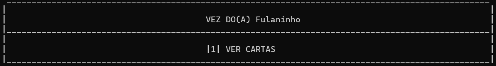

# UNO

**Disciplina**: FGA0210 - PARADIGMAS DE PROGRAMAÇÃO - T02 <br>
**Nro do Grupo (de acordo com a Planilha de Divisão dos Grupos)**: 02<br>
**Paradigma**: Funcional<br>

## Alunos
|Matrícula | Aluno |
| -- | -- |
| 180099353  |  Cibele Freitas Goudinho - @CibeleG |
| 190108011  |  Guilherme Brito Vilas Boas - @dev-brito |
| 170105342  |  Irwin Schmitt - @irwinschmitt |
| 180103792  |  Júlia Farias Sousa - @julisous |
| 180104390  |  Lameque Fernandes Azevedo - @LamequeFernandes |
| 201000379  |  Leonardo Milomes Vitoriano - @leonardomilv3 |
| 180078224  |  Thaís Rebouças de Araujo - @Thais-ra |
| 200028367  |  Victor Hugo Oliveira Leão - @victorleaoo |

## Sobre
A fim de praticar os conhecimentos do Paradigma Funcional, foi desenvolvido o jogo de cartas [UNO](https://www.letsplayuno.com/) na linguagem Haskell.

Para aqueles que não conhecem o jogo, ele funciona, basicamente, da seguinte maneira:

1. Cada jogador recebe, inicialmente, 7 cartas de um monte de cartas composto por cartas de 0-9 separadas entre as cores azul, vermelho, amarelo e verde, além de cartas especiais (bloqueio, reverter a ordem, comprar 2 ou 4 cartas e mudar a cor da carta do topo).
2. Uma carta de topo é colocada e, assim, os jogadores tem que jogar, por rodada, uma de suas cartas que são válidas ou de cor ou de número/tipo, atualizando a carta de topo pelas suas jogadas. Caso a carta tenha algum efeito especial, ele também é acionado.
3. O jogador pode comprar cartas do monte de cartas, caso ele não possua nenhuma válida.
4. Quando um jogador só possuí uma carta, ele deve sinalizar UNO.
5. Ganha (e acaba com o jogo) aquele jogador que não tiver posse de nenhuma carta antes de todos os outros.

Imagem de exemplo dos tipos de cartas presentes no jogo UNO:


## Screenshots





## Instalação
**Linguagens**: Haskell<br>
**Tecnologias**: GHCi (versão 9.2.7) e Cabal (3.6.2.0).<br>

Com as tecnologias acima citadas instaladas, para rodar o jogo/projeto, siga os seguintes passos:

1. Rode os comandos ```sudo apt install cabal-install``` e ```cabal update```.
2. Instale as dependências e rode o jogo com  ```cabal run```.

## Uso
A partir dos passos acima, o jogo já estará sendo executado, assim, só seguir as instruções na tela para jogar. Se divirta! :)

## Vídeo
Link para o vídeo no Youtube  https://youtu.be/DLZ7Eg6vu2k


## Participações

|Nome do Membro | Contribuição | Significância da Contribuição para o Projeto (Excelente/Boa/Regular/Ruim/Nula) |
| -- | -- | -- |
| Cibele Freitas Goudinho - @CibeleG | Desenvolvimento da [validGame](https://github.com/UnBParadigmas2023-1-Turma02/2023.1_G1_Funcional_UNO/tree/validGame) em dupla com a Julia. Desenvolvimento da função selectValidCard na logica geral em pareamento com Leonardo e Victor. | Excelente |
| Guilherme Brito Vilas Boas - @dev-brito | Desenvolvimento de Lógica para [Cartas Especiais](https://github.com/UnBParadigmas2023-1-Turma02/2023.1_G1_Funcional_UNO/blob/main/app/SpecialCards.hs), Integração da lógica de Cartas Especiais para a Lógica Geral do Jogo | Excelente |
| Irwin Schmitt - @irwinschmitt | Configuracão do repositório com o `cabal`; Desenvolvimento da interface de seleção de cartas ([app/UI/](https://github.com/UnBParadigmas2023-1-Turma02/2023.1_G1_Funcional_UNO/tree/main/app/UI)). |Excelente|
| Júlia Farias Sousa - @julisous | Desenvolvimento da [validGame](https://github.com/UnBParadigmas2023-1-Turma02/2023.1_G1_Funcional_UNO/tree/validGame) em dupla com a Cibele| Boa |
| Lameque Fernandes Azevedo - @LamequeFernandes | Desenvolvimento das funções presentes no [UI.hs](https://github.com/UnBParadigmas2023-1-Turma02/2023.1_G1_Funcional_UNO/blob/main/app/UI.hs), [AuxCards.hs](https://github.com/UnBParadigmas2023-1-Turma02/2023.1_G1_Funcional_UNO/blob/main/app/AuxCards.hs) e de algumas presentes no [Utils.hs](https://github.com/UnBParadigmas2023-1-Turma02/2023.1_G1_Funcional_UNO/blob/main/app/UI/Utils.hs); Integração de parte do "frontend" com a lógica do projeto. | Excelente |
| Leonardo Milomes Vitoriano - @leonardomilv3 | Desenvolvimento da [logicaGeral](https://github.com/UnBParadigmas2023-1-Turma02/2023.1_G1_Funcional_UNO/tree/logicaGeral) em dupla com o membro Victor:<br>- Leitura dos jogadores e distribuição da mão deles<br>- Parte da implementação da função playGame e playTurn: verificar se o jogador está de UNO; encerrar o jogo; validar mão do jogador e carta jogada no topo  | Excelente |
| Thaís Rebouças de Araujo - @Thais-ra | Desenvolvimento de Lógica para [Cartas Especiais](https://github.com/UnBParadigmas2023-1-Turma02/2023.1_G1_Funcional_UNO/blob/main/app/SpecialCards.hs) | Boa |
| Victor Hugo Oliveira Leão - @victorleaoo | Desenvolvimento da [logicaGeral](https://github.com/UnBParadigmas2023-1-Turma02/2023.1_G1_Funcional_UNO/tree/logicaGeral) em dupla com o membro Leonardo:<br>- Criação do monte de cartas (deck) e seu embaralhamento<br>- Parte da implementação da função playGame e playTurn: funcionamento inicial da lista rotativa de jogadores; comprar carta do monte; manipulação (selecionar e retirar) carta jogada pelo jogador. | Excelente |

## Outros

(i) Lições Aprendidas:
* Como desenvolver um projeto com base no Paradigma Funcional. Assim, a manipulação de listas (variáveis imutáveis) e recursividade foram elementos muito explorados, elementos muitas vezes negligenciados quando trabalhando com outros paradigmas e linguagens não similares ao Haskell, por exemplo.
* Iteração Vs. Recursão -> Em outros paradigmas e linguagens o uso de loops é comum nos programas, mas sabemos que toda iteração pode ser transformada em uma Recursão. No Haskell, o lado recursivo dos Loops é muito encorajado. Logo, nesse trabalho foi exercitado essa tradução de Algoritmos Iterativos em Recursivos, como por exemplo na [função responsável pela compra de cartas do topo 'n' vezes](https://github.com/UnBParadigmas2023-1-Turma02/2023.1_G1_Funcional_UNO/blob/main/app/SpecialCards.hs#L34)

(ii) Percepções:
* Por estarem condicionados e acostumados com o Paradigma Procedural, muitas vezes, de primeira, era complexo ver uma solução totalmente voltada ao Paradigma Funcional.

(iii) Contribuições e Fragilidades:
* Verificar e validar entradas do usuário.
* Funcionalidades de diferentes modos de jogadas, como, por exemplo, jogar sequências.
* Jogo condicionado ao caminho feliz, não tem muitos tratamentos e validações, seria interessante adição desses tratamentos

(iV) Trabalhos Futuros:
* Modo de jogo por LAN (jogadores na mesma rede, mas em computadores diferentes).

## Fontes
> - Biblioteca Random (Shuffle): https://hackage.haskell.org/package/random-shuffle-0.0.4/docs/System-Random-Shuffle.html
> - GHCi: https://downloads.haskell.org/ghc/latest/docs/users_guide/ghci.html
> - Cabal: https://cabal.readthedocs.io/en/stable/
